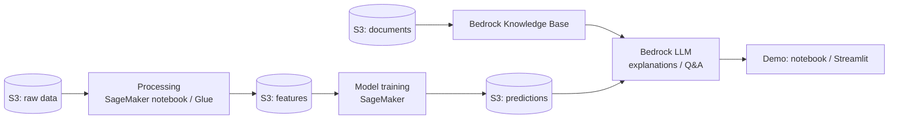

# Architecture (keep in sync with what actually ran)

```mermaid
flowchart LR
  raw[(S3: raw data)] --> prep[Processing<br/>SageMaker notebook / Glue]
  prep --> feat[(S3: features)]
  feat --> model[Model training<br/>SageMaker]
  docs[(S3: documents)] --> kb[Bedrock Knowledge Base]
  kb --> llm[Bedrock LLM<br/>explanations / Q&A]
  model --> out[(S3: predictions)]
  out --> llm
  llm --> ui[Demo: notebook / Streamlit]
```

Replace with the real thing. Delete boxes you didn't build. Judges check this against the demo.
